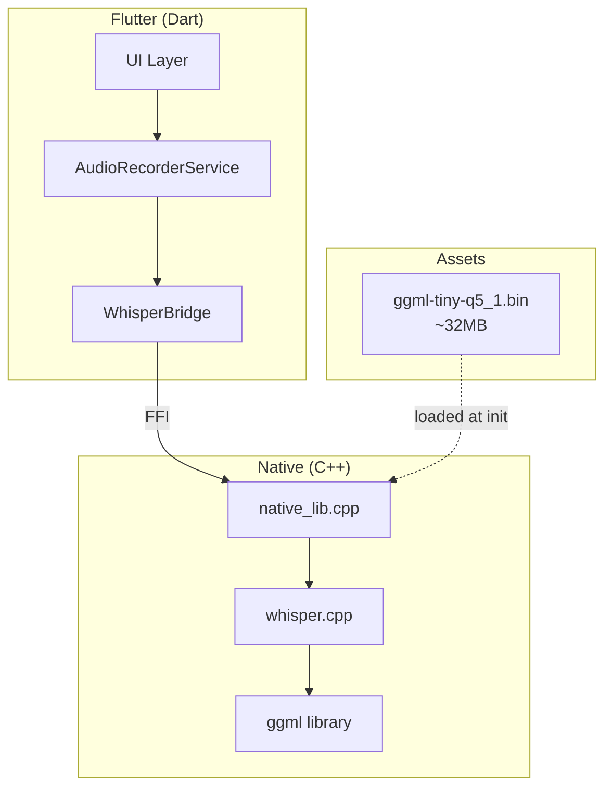
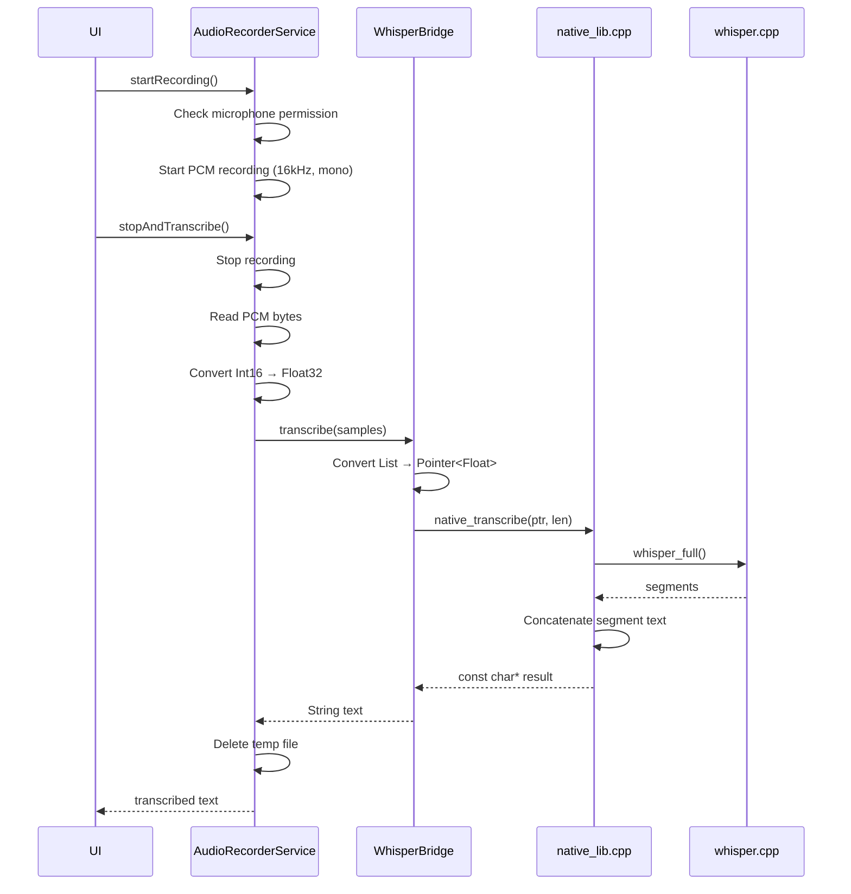

# 🎙️ Whisper Transcription Implementation

Este documento describe la arquitectura de transcripción de voz usando **whisper.cpp** en FastVoiceNote.

## Resumen de Arquitectura



---

## Componentes Principales

### 1. Capa Nativa (C++)

**Archivo:** [native_lib.cpp](file:///e:/programacion/trabajos/FastVoiceNote-Flutter/native/native_lib.cpp)

Expone 3 funciones FFI:

| Función | Firma | Descripción |
|---------|-------|-------------|
| `native_init_whisper` | `int (const char* model_path)` | Carga el modelo. Retorna 0=éxito, -1=error |
| `native_transcribe` | `const char* (float* samples, int n_samples)` | Transcribe audio PCM float32 |
| `native_free_whisper` | `void ()` | Libera recursos del contexto |

**Configuración de transcripción:**
```cpp
wparams.language = "es";        // Español forzado
wparams.translate = false;      // Sin traducción
wparams.no_timestamps = true;   // Sin marcas de tiempo
wparams.print_progress = false; // Optimizado para mobile
```

**Thread Safety:** Usa `std::mutex g_mutex` para proteger el contexto global.

---

### 2. Puente FFI (Dart)

**Archivo:** [whisper_bridge.dart](file:///e:/programacion/trabajos/FastVoiceNote-Flutter/lib/src/core/transcription/whisper_bridge.dart)

**Patrón:** Singleton (`WhisperBridge()`)

**Flujo de inicialización:**
1. Carga `libwhisper.so` (Android) o `DynamicLibrary.process()` (iOS)
2. Busca símbolos: `native_init_whisper`, `native_transcribe`, `native_free_whisper`
3. Copia modelo desde assets a documentos (si no existe)
4. Llama `_initWhisper(modelPath)`

**Conversión de datos:**
```dart
// List<double> → Pointer<Float> para FFI
final pointer = calloc<Float>(samples.length);
final buffer = pointer.asTypedList(samples.length);
for (int i = 0; i < samples.length; i++) {
  buffer[i] = samples[i];
}
```

---

### 3. Servicio de Grabación

**Archivo:** [audio_recorder_service.dart](file:///e:/programacion/trabajos/FastVoiceNote-Flutter/lib/src/features/transcription/services/audio_recorder_service.dart)

**Configuración de audio (compatible con Whisper):**
```dart
const config = RecordConfig(
  encoder: AudioEncoder.pcm16bits,  // Raw PCM
  bitRate: 128000,
  sampleRate: 16000,                // Whisper native rate
  numChannels: 1,                   // Mono
);
```

**Procesamiento de audio:**
```dart
// Int16 → Float32 normalizado (-1.0 a 1.0)
for (int i = 0; i < numSamples; i++) {
  final sample = data.getInt16(i * 2, Endian.little);
  samples[i] = sample / 32768.0;
}
```

---

## Configuración de Build (Android)

**Archivo:** [CMakeLists.txt](file:///e:/programacion/trabajos/FastVoiceNote-Flutter/android/app/src/main/cpp/CMakeLists.txt)

```cmake
# Optimizaciones para mobile
target_compile_options(whisper PRIVATE -O3 -ffast-math)
target_compile_options(whisper PRIVATE -ffunction-sections -fdata-sections)

# NEON para ARM
if (${ANDROID_ABI} STREQUAL "armeabi-v7a")
    target_compile_options(whisper PRIVATE -mfpu=neon)
endif()
```

> [!WARNING]
> Se removió `-march=armv8.2-a+fp16` por causar SIGILL en Snapdragon 660 y chips anteriores.

---

## Modelo de IA

| Propiedad | Valor |
|-----------|-------|
| **Archivo** | `assets/models/ggml-tiny-q5_1.bin` |
| **Tamaño** | ~32 MB |
| **Tipo** | Whisper Tiny cuantizado (Q5_1) |
| **Idioma** | Multi-idioma (forzado a español en runtime) |

El modelo se copia de assets a documentos de la app en primera ejecución:
```
assets/models/ggml-tiny-q5_1.bin → {app_documents}/model.bin
```

---

## Dependencias (pubspec.yaml)

```yaml
dependencies:
  ffi: ^2.1.0                 # Foreign Function Interface
  record: ^6.1.2              # Grabación de audio  
  permission_handler: ^11.1.0 # Permisos de micrófono
  path_provider: ^2.1.5       # Rutas de documentos
```

---

## Flujo Completo de Transcripción



---

## Limitaciones Conocidas

| Limitación | Impacto | Mitigación Posible |
|------------|---------|-------------------|
| FFI bloquea UI thread | Freeze durante transcripción larga | Usar `Isolate.run()` |
| Contexto global singleton | No soporta múltiples instancias | Rediseñar con handles |
| String estático en retorno | Race condition teórica | Mutex actual lo protege |
| Solo Android/iOS | Sin soporte desktop/web | Agregar backends nativos |

---

## Archivos Clave

| Capa | Archivo | Responsabilidad |
|------|---------|-----------------|
| Native | `native/native_lib.cpp` | Wrapper de whisper.cpp |
| Native | `native/whisper.cpp/` | Librería whisper (submodule) |
| Build | `android/.../CMakeLists.txt` | Configuración de compilación |
| FFI | `lib/src/core/transcription/whisper_bridge.dart` | Puente Dart-C++ |
| Service | `lib/src/features/transcription/services/audio_recorder_service.dart` | Orquestación grabación + transcripción |
| Assets | `assets/models/ggml-tiny-q5_1.bin` | Modelo Whisper Tiny |
