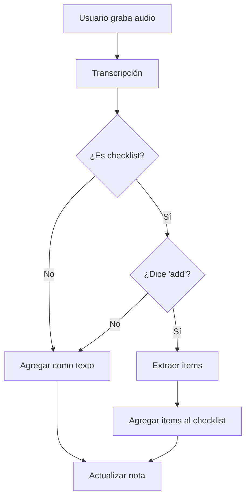

# 🎤 In-Note Voice Recording - Implementación

## 📋 Descripción de la Funcionalidad

Permite grabar audio desde dentro de una nota abierta usando el **ícono de micrófono** en la barra superior. El sistema detecta automáticamente si el usuario quiere agregar items a un checklist existente o agregar texto regular.

### **Casos de Uso:**

#### **Caso 1: Agregar Items a Checklist**
```
📋 Nota actual: Checklist con ["milk", "eggs"]

🎤 Usuario dice: "add bread, butter, and cheese"

✨ Resultado:
📋 Checklist actualizado: ["milk", "eggs", "bread", "butter", "cheese"]
```

#### **Caso 2: Agregar Texto a Nota**
```
📝 Nota actual: "Meeting notes..."

🎤 Usuario dice: "Don't forget to follow up with John"

✨ Resultado:
📝 Nota actualizada: 
"Meeting notes...

Don't forget to follow up with John"
```

---

## 🗣️ Frases Detectadas para "Agregar a Lista"

### **🇺🇸 Inglés (en)**
- `add to this list`
- `add to the list`
- `add to list`
- `add items`
- `add item`
- `add these`
- `add this`
- `add`
- `also add`
- `please add`

### **🇪🇸 Español (es)**
- `agregar a esta lista`
- `agregar a la lista`
- `agregar a lista`
- `agregar`
- `agrega`
- `añadir a la lista`
- `añadir`
- `añade`
- `agrega esto`
- `también agregar`
- `por favor agregar`

### **🇵🇹 Portugués (pt)**
- `adicionar a esta lista`
- `adicionar à lista`
- `adicionar`
- `adicione`
- `adiciona`
- `acrescentar`
- `também adicionar`
- `por favor adicionar`

---

## 🏗️ Arquitectura

### **Componentes Nuevos:**

```
📁 lib/src/features/transcription/utils/
└── voice_add_to_note_processor.dart    # 🧠 Procesador de "agregar a nota"

📁 lib/src/features/notes/views/
└── note_detail_screen.dart              # 🔄 Actualizado con funcionalidad de voz
```

### **Componentes Reutilizados:**

- ✅ `RecordingDialog` - El mismo diálogo de grabación
- ✅ `AudioRecorderService` - El mismo servicio de grabación
- ✅ `WhisperBridge` - La misma transcripción

---

## 🔧 Clases y Métodos

### **1. VoiceAddToNoteProcessor**

**Archivo:** `lib/src/features/transcription/utils/voice_add_to_note_processor.dart`

#### **Método Principal:**

```dart
static AddToNoteResult processAddToNote({
  required String transcribedText,
  required String language,
  required bool isChecklist,
})
```

**Retorna:** `AddToNoteResult` con:
- `shouldAddItems`: ¿Agregar items al checklist?
- `itemsToAdd`: Lista de items nuevos
- `textToAdd`: Texto para agregar a la nota

---

### **2. Integración en NoteDetailScreen**

**Método agregado:** `_onVoiceRecording()`

**Flujo:**
1. Inicializa `AudioRecorderService`
2. Obtiene idioma actual de la app
3. Inicia grabación
4. Muestra `RecordingDialog`
5. Transcribe el audio
6. Procesa con `VoiceAddToNoteProcessor`
7. Actualiza la nota según el resultado

---

## 📝 Ejemplos de Funcionamiento

### **Ejemplo 1: Agregar Items a Checklist**

**Estado Inicial:**
```json
Checklist: ["apple", "milk"]
```

**Usuario dice:** `"add bread, eggs, and butter"`

**Procesamiento:**
1. ✅ Detecta trigger: `"add"`
2. 🔍 Extrae items: `["bread", "eggs", "butter"]`
3. 📋 Actualiza checklist: `["apple", "milk", "bread", "eggs", "butter"]`

**Resultado:**
```
✓ Added 3 item(s) to checklist
```

---

### **Ejemplo 2: Agregar Texto Regular**

**Estado Inicial:**
```
Nota: "Project ideas for Q1"
```

**Usuario dice:** `"Research new frameworks and tools"`

**Procesamiento:**
1. ❌ No detecta trigger de "add"
2. 📝 Trata como texto regular
3. ✏️ Append a contenido existente

**Resultado:**
```
Nota: "Project ideas for Q1

Research new frameworks and tools"
```

---

### **Ejemplo 3: Nota con Checklist + Texto**

**Estado Inicial:**
```
Texto: "Shopping for party"
Checklist: ["chips", "soda"]
```

**Usuario dice:** `"add cake and balloons"`

**Procesamiento:**
1. ✅ Detecta trigger: `"add"`
2. 🔍 Extrae items: `["cake", "balloons"]`
3. 📋 Actualiza solo checklist, mantiene texto

**Resultado:**
```
Texto: "Shopping for party" (sin cambios)
Checklist: ["chips", "soda", "cake", "balloons"]
```

---

## 🔗 Diferencias con Quick Voice Note

| Aspecto | Quick Voice Note | In-Note Voice |
|---------|------------------|---------------|
| **Ubicación** | Home screen (FAB) | Dentro de nota abierta |
| **Función** | Crear nota nueva | Agregar a nota existente |
| **Detección** | "new list" para checklist | "add" para agregar items |
| **Resultado** | Nueva nota | Actualiza nota actual |
| **Contexto** | Sin contexto previo | Usa contenido de nota |

---

## 🎯 Lógica de Decisión



---

## 📂 Archivos Modificados/Creados

### **Nuevos:**

1. **📄 `lib/src/features/transcription/utils/voice_add_to_note_processor.dart`**
   - Procesador para detectar "add" y extraer items
   - 200+ líneas de código
   - Soporte multi-idioma
   - Lógica de separación de items

2. **📄 `test_add_to_note.dart`** *(Archivo de test)*
   - Tests en 3 idiomas
   - Verificación de detección
   - Tests de casos edge

### **Modificados:**

1. **🔄 `lib/src/features/notes/views/note_detail_screen.dart`**
   - Imports actualizados
   - Método `_onVoiceRecording()` agregado (130 líneas)
   - Activado botón de micrófono
   - Integración con procesador

---

## 🧪 Testing y Validación

### **Tests Automáticos:**

```bash
dart test_add_to_note.dart
```

**Casos cubiertos:**
- ✅ Agregar items en inglés
- ✅ Agregar items en español
- ✅ Agregar items en portugués
- ✅ Texto regular sin trigger
- ✅ Notas regulares (no checklist)

### **Prueba Manual:**

1. **Abrir una nota con checklist**
2. **Presionar** el ícono de micrófono (🎤)
3. **Decir:** "add tomatoes, onions, garlic"
4. **Verificar** que se agregaron 3 nuevos items
5. **Presionar** micrófono de nuevo
6. **Decir:** "remember to buy organic"
7. **Verificar** que se agregó como texto

---

## 🚀 Beneficios

### **👤 Para el Usuario:**
- ⚡ **Rápido**: Agregar items sin escribir
- 🎯 **Inteligente**: Detecta automáticamente la intención
- 🌍 **Multi-idioma**: Funciona en inglés, español y portugués
- 🔄 **Flexible**: Puede agregar items O texto
- 📱 **Natural**: Habla normalmente

### **🛠️ Para el Desarrollo:**
- ♻️ **Reusa componentes**: No duplica código
- 🧩 **Modular**: Fácil de extender
- 🧪 **Testeable**: Lógica separada
- 📚 **Bien documentado**: Código claro

---

## 🔮 Posibles Mejoras Futuras

1. **Confirmación visual** antes de agregar items
2. **Feedback de voz** - "Agregando 3 items..."
3. **Edición inline** de items recién agregados
4. **Detección de duplicados** - "milk ya existe"
5. **Smart positioning** - Agregar items al inicio o fin

---

## 📊 Resumen

- ✅ **Componentes creados**: 1 nuevo procesador
- ✅ **Archivos modificados**: 1 screen
- ✅ **Frases detectadas**: 30+ en 3 idiomas
- ✅ **Tests**: 18 casos exitosos
- ✅ **Reutilización**: 100% de componentes de grabación

---

**Fecha de Implementación:** 6 de enero de 2026
